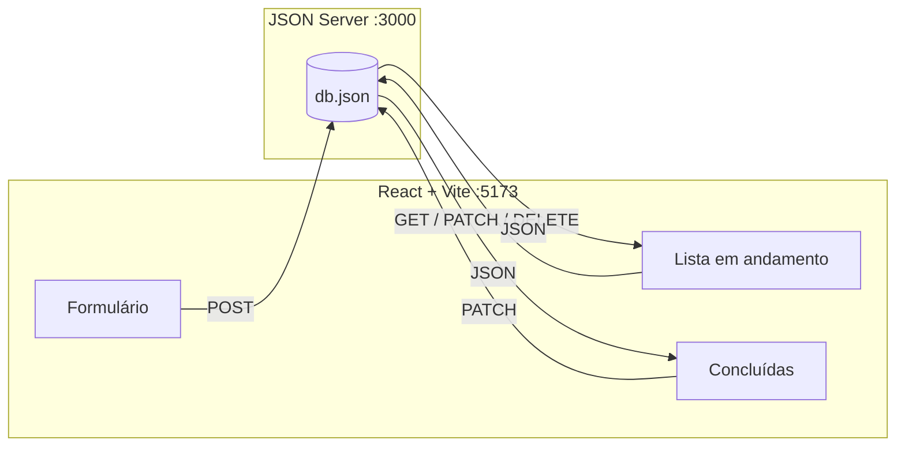

<div align="center">

# Minhas Tarefas

**Aplicação de gerenciamento de tarefas com React, Vite e JSON Server**

[](https://react.dev/)
[](https://vite.dev/)
[](https://github.com/typicode/json-server)

Cadastro, listagem e organização de tarefas em **três colunas** — com tema claro/escuro, prioridades, prazos e status opcional.

[Funcionalidades](#-funcionalidades) · [Como executar](#-como-executar) · [API](#-api-rest) · [Estrutura](#-estrutura-do-projeto)

</div>

---

## Preview

| Nova tarefa | Em andamento | Concluídas |
|:-----------:|:------------:|:----------:|
| Formulário com campos obrigatórios e opcionais | Cards com prioridade, prazo e status | Lista compacta com checkbox e prioridade |

> **Dica:** após rodar o projeto, tire um print da tela e salve como `docs/preview.png` para exibir aqui:
>
> ``

---

## Funcionalidades

| Recurso | Descrição |
|---------|-----------|
| Cadastro | Formulário com título, descrição, prioridade, prazo e status (opcionais onde indicado) |
| Listagem | `fetch` + `useEffect` para carregar tarefas da API |
| Status | Não iniciada, Pendente, Em execução, Concluída — opcional na criação e na lista |
| Colunas | Andamento e Concluídas separadas; contador de tarefas finalizadas |
| Conclusão | Checkbox nas tarefas concluídas; desmarcar devolve para andamento |
| Exclusão | Botão em cada card (ícone X) com confirmação |
| Tema | Modo claro e escuro (lua / sol) com preferência salva |
| API fake | `db.json` + JSON Server na porta `3000` |

---

## Como funciona



1. O **frontend** envia requisições HTTP com `fetch`.
2. O **JSON Server** simula uma API REST lendo e gravando em `db.json`.
3. A interface atualiza com `useState` após cada operação.

---

## Como executar

### Pré-requisitos

- [Node.js](https://nodejs.org/) (versão 18 ou superior)
- npm

### Passo a passo

<table>
<tr>
<td width="40"><strong>1</strong></td>
<td>

Clone o repositório e entre na pasta:

```bash
git clone https://github.com/SEU_USUARIO/SEU_REPOSITORIO.git
cd SEU_REPOSITORIO
```

</td>
</tr>
<tr>
<td><strong>2</strong></td>
<td>

Instale as dependências:

```bash
npm install
```

</td>
</tr>
<tr>
<td><strong>3</strong></td>
<td>

Abra **dois terminais** na pasta do projeto.

**Terminal A — API:**

```bash
npm run api
```

Base: `http://localhost:3000`

</td>
</tr>
<tr>
<td><strong>4</strong></td>
<td>

**Terminal B — Frontend:**

```bash
npm run dev
```

Acesse: `http://localhost:5173`

</td>
</tr>
</table>

### Scripts disponíveis

| Comando | Ação |
|---------|------|
| `npm run dev` | Inicia o React (Vite) |
| `npm run api` | Inicia o JSON Server |
| `npm run build` | Gera build de produção |
| `npm run preview` | Visualiza o build |
| `npm run lint` | Verifica o código com ESLint |

---

## API REST

| Método | Endpoint | Descrição |
|:------:|----------|-----------|
| `GET` | `/tarefas` | Lista todas as tarefas |
| `POST` | `/tarefas` | Cadastra nova tarefa |
| `PATCH` | `/tarefas/:id` | Atualiza status ou campos |
| `DELETE` | `/tarefas/:id` | Remove uma tarefa |

### Exemplo de tarefa (`db.json`)

```json
{
  "id": "1",
  "titulo": "Estudar React",
  "descricao": "Revisar hooks useState e useEffect",
  "prioridade": "alta",
  "status": "em_execucao",
  "prazo": "2026-06-15"
}
```

| Campo | Obrigatório | Valores |
|-------|:-----------:|---------|
| `titulo` | Sim | Texto |
| `descricao` | Sim | Texto |
| `prioridade` | Sim | `alta`, `media`, `baixa` |
| `prazo` | Não | Data `AAAA-MM-DD` |
| `status` | Não | `nao_iniciada`, `pendente`, `em_execucao`, `concluida` |

---

## Estrutura do projeto

```
React API JSON Server/
├── db.json              # Banco fake (JSON Server)
├── public/
├── src/
│   ├── App.jsx          # Componente principal
│   ├── App.css          # Estilos da aplicação
│   ├── index.css        # Variáveis e tema global
│   └── main.jsx         # Entrada do React
├── index.html
├── package.json
└── README.md
```

---

## Requisitos da atividade (checklist)

- [x] Projeto React + Vite
- [x] `db.json` configurado
- [x] JSON Server local (`npm run api`)
- [x] Listagem com `fetch`
- [x] `useState` e `useEffect`
- [x] Formulário com pelo menos 3 campos
- [x] Cadastro via `POST`
- [x] Atualização da lista após cadastro
- [x] Interface organizada
- [ ] Publicação no GitHub *(substitua pelo link do seu repositório)*

---

## Publicar no GitHub

```bash
git init
git add .
git commit -m "feat: aplicação de cadastro de tarefas com React e JSON Server"
git branch -M main
git remote add origin https://github.com/SEU_USUARIO/SEU_REPOSITORIO.git
git push -u origin main
```

---

## Autores

| | |
|---|---|
| **Yago Presot** | **Gabriel Abreu** |

Disciplina: Desenvolvimento Web Front-End — UNI

---

<div align="center">

Feito com React, Vite e JSON Server · Yago Presot & Gabriel Abreu

</div>
